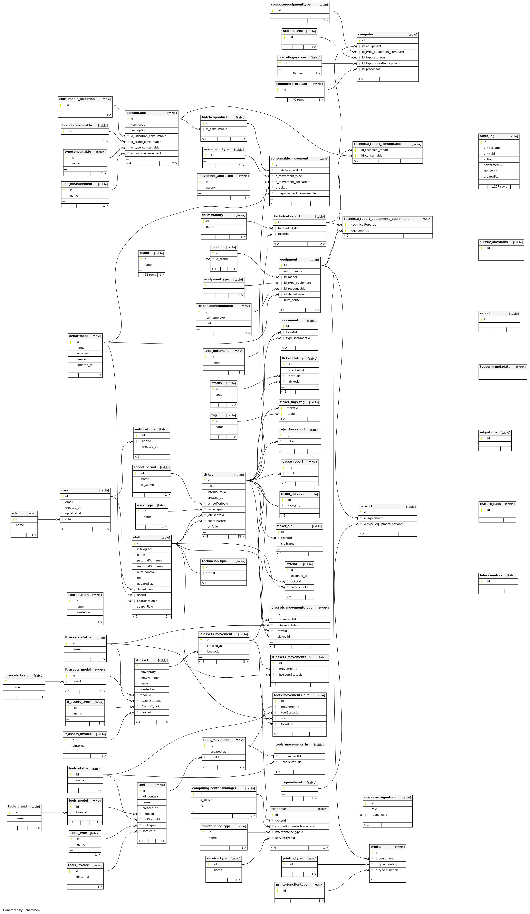
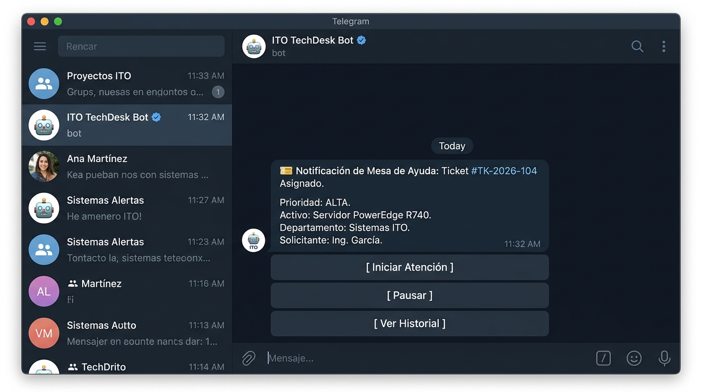
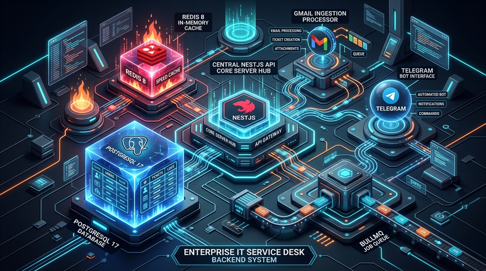
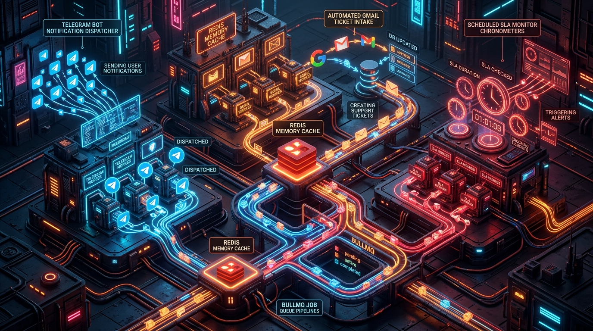
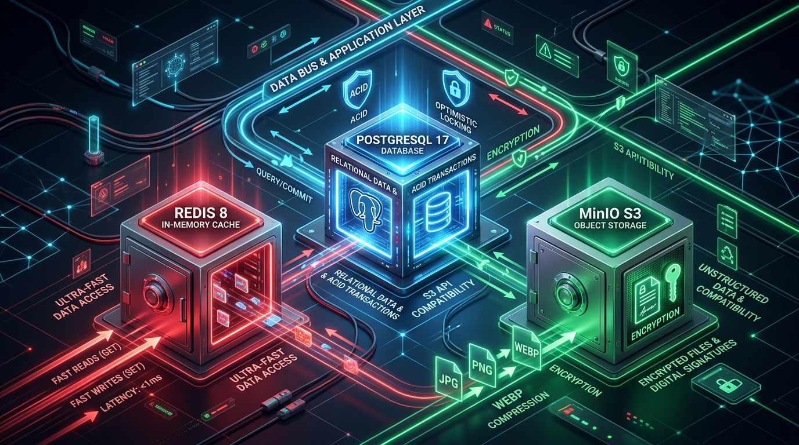

# 🎫 IT Service Desk, Help Desk & Enterprise ITAM Platform (Backend API)

<p align="center">
  
  
  
  
  
  
  
  
  
</p>

---

## 📌 Tabla de Contenidos
- [1. Visión General del Proyecto](#1-visión-general-del-proyecto)
- [2. Galería Visual y Demostración](#2-galería-visual-y-demostración)
- [3. Arquitectura del Sistema](#3-arquitectura-del-sistema)
- [4. Módulos y Capacidades del Negocio](#4-módulos-y-capacidades-del-negocio)
- [5. Desafíos de Ingeniería y Patrones de Diseño](#5-desafíos-de-ingeniería-y-patrones-de-diseño)
- [6. Calidad de Código y Testing](#6-calidad-de-código-y-testing)
- [7. Infraestructura y Despliegue en Producción](#7-infraestructura-y-despliegue-en-producción)
- [8. Puesta en Marcha Local](#8-puesta-en-marcha-local)
- [9. Variables de Entorno](#9-variables-de-entorno)
- [10. Propiedad Intelectual, Institución y Colaboradores](#10-propiedad-intelectual-institución-y-colaboradores)

---

## 1. Visión General del Proyecto

Plataforma backend de nivel empresarial para la **Gestión de Servicios de Tecnologías de la Información (ITSM)**, control integral de **Mesa de Ayuda (Help Desk / Ticketing)**, trazabilidad del **Ciclo de Vida de Activos TI (ITAM)**, pañol de **herramientas**, almacén de **consumibles por lotes** y cálculo automatizado de **Acuerdos de Nivel de Servicio (SLA)**.

Diseñada con **Clean Architecture**, **Domain-Driven Design (DDD)** y el **Principio de Responsabilidad Única (SRP)**, la plataforma garantiza:
- **Consistencia Transaccional ACID:** Operaciones atómicas multi-tabla para inventario, asignaciones y firmas digitales.
- **Concurrencia Optimista:** Prevención de colisiones y sobreescrituras en tickets con `@VersionColumn`.
- **Procesamiento Asíncrono:** Colas distribuidas con BullMQ y Redis para bots de Telegram, ingesta de correos (Gmail) y monitores de SLA.
- **Tiempo Real:** Notificaciones bidireccionales con WebSockets (Socket.IO + Redis Adapter) escalables horizontalmente.
- **Seguridad Robusta:** Autenticación sin estado mediante JWT en cookies `HttpOnly` (`SameSite: lax`), RBAC dinámico con decoradores compuestos, rate limiting distribuido y cabeceras seguras con Helmet.

---

## 2. Galería Visual y Demostración

> *A continuación se presentan las evidencias operativas y arquitectónicas del sistema:*

### 2.1. Documentación Interactiva Swagger / OpenAPI

*Explorador interactivo de endpoints con esquemas DTO tipados, códigos de respuesta HTTP y autenticación por cookies.*

---

### 2.2. Suite de Pruebas Unitarias Automatizadas (Jest)

*92 suites de prueba y 705+ tests unitarios pasando al 100% en verde con tipado estricto (0 uso de `any`).*

---

### 2.3. Diagrama Entidad-Relación de la Base de Datos (PostgreSQL 17)

*Modelado en 3ra Forma Normal (3NF), índices compuestos, columnas calculadas `tsvector` y llaves foráneas con eliminación restringida/en cascada controlada.*

---

### 2.4. Orquestación de Contenedores en Docker (Stack Completo)

*Entorno contenerizado multi-nodo: PostgreSQL, Redis, MinIO S3, Nginx Reverse Proxy, Migrator desacoplado y Backend Distroless.*

---

### 2.5. Almacenamiento de Objetos en MinIO S3

*Gestión de archivos binarios, firmas digitales y fotos de activos convertidas automáticamente a formato `.webp` con Sharp tras validación de magic bytes.*

---

### 2.6. Integraciones Asíncronas y Bot de Telegram

*Canal interactivo para técnicos y coordinadores impulsado por workers de BullMQ y Redis con reintentos exponenciales.*

---

## 3. Arquitectura del Sistema

<p align="center">
  
</p>

```
                                  ┌──────────────────────────┐
                                  │      Nginx (Reverse      │
                                  │    Proxy / SSL Term.)    │
                                  └─────────────┬────────────┘
                                                │ :8081 / :443
                                                ▼
                                  ┌──────────────────────────┐
                                  │     NestJS API Core      │
                                  │   (TypeScript 5.7+)      │
                                  └───────┬──────────┬───────┘
                                          │          │
                 ┌────────────────────────┴─┐      ┌─┴────────────────────────┐
                 ▼                          ▼      ▼                          ▼
      ┌─────────────────────┐   ┌──────────────────────┐   ┌──────────────────────┐
      │    PostgreSQL 17    │   │       Redis 8        │   │       MinIO S3       │
      │  - tsvector + GIN   │   │  - Cache Layer       │   │  - WebP Pipelines    │
      │  - QueryRunner ACID │   │  - Bull / BullMQ     │   │  - Sanitized Uploads │
      │  - @VersionColumn   │   │  - Socket.IO Adapter │   │  - Magic Bytes Check │
      └─────────────────────┘   └──────────────────────┘   └──────────────────────┘
                 ▲                          ▲
                 │                          │
                 └──────────┬───────────────┘
                            │
              ┌─────────────┴─────────────┐
              │  Asynchronous Workers     │
              │  - Telegram Bot Worker    │
              │  - Gmail Parser Worker    │
              │  - SLA Monitor Cron Jobs  │
              └───────────────────────────┘
```

---

## 4. Módulos y Capacidades del Negocio

El sistema se compone de más de 90 módulos simétricos organizados en dominios independientes:

### 🎫 4.1. Mesa de Ayuda y Ciclo de Vida del Ticket (`src/tickets`)
- **Flujo Completo de Estados:** `PENDIENTE` $\rightarrow$ `ASIGNADO` $\rightarrow$ `EN PROCESO` $\rightarrow$ `PAUSADO` $\rightarrow$ `FINALIZADO` $\rightarrow$ `CERRADO` (o `RECHAZADO`).
- **Separación SRP por Servicio:** Cada transición de estado cuenta con su servicio aislado (`create-ticket`, `assign-ticket`, `start-ticket`, `close-ticket`, `finish-ticket`, `intervene-ticket`, `reject-ticket`, `archive-ticket`).
- **Firmas y Conformidad:** Módulo de firmas digitales en Canvas con almacenamiento en S3 y generación de actas de entrega en PDF (`src/response-pdfs`).
- **Reportes:** Exportación analítica en Excel (`src/excel`) y reportes de tiempo de atención (`src/reports`).

### ⏱️ 4.2. Acuerdos de Nivel de Servicio (`src/sla`)
- **Cálculo de Tiempos Hábiles:** Considera horarios laborales y días festivos para evitar penalizaciones injustas fuera de turno.
- **Monitoreo Continuo:** Tareas programadas (`@nestjs/schedule`) que evalúan tickets próximos a vencer y disparan alertas proactivas a supervisores.

### 💻 4.3. Gestión de Activos TI (`src/it-assets`)
- **Catálogo Normalizado:** Marcas (`brands`), Modelos (`models`), Tipos de Activos (`types`) y Estados Operativos (`status`).
- **Trazabilidad de Movimientos (`movements`):** Registro inmutable de entradas (`movements-in`) y salidas (`movements-out`) vinculadas a personal (`Staff`) y tickets de soporte.
- **Facturación:** Vinculación de folios de factura (`invoices`) a los activos físicos para control contable y depreciación.

### 📦 4.4. Consumibles y Lotes (`src/consumables`)
- **Control de Inventario por Lotes (`batches`):** Seguimiento de fechas de caducidad, cantidades disponibles y puntos de reorden.
- **Aplicación de Movimientos:** Salidas de consumibles asociadas a tickets o departamentos para imputación de costos.

### 🛠️ 4.5. Pañol de Herramientas (`src/tools`)
- Control de préstamo y devolución de instrumental especializado para el equipo técnico.
- Historial de estados de desgaste y bitácora de responsables.

### 🤖 4.6. Ingesta Multicanal y Procesamiento Asíncrono
<p align="center">
  
</p>

- **Telegram Bot:** Interacción conversacional con técnicos para asignación rápida de tickets mediante teclado inline y webhooks/polling.
- **Gmail Parser:** Conversión automática de correos recibidos en la cuenta de soporte en tickets formales.
- **Workers BullMQ & Redis:** Desacoplamiento de envíos de correo, alertas y tareas pesadas con políticas de backoff y dead-letter queues.
- **WebSockets en Tiempo Real:** Transmisión instantánea de eventos a tableros administrativos utilizando Socket.IO y Redis.

---

## 5. Desafíos de Ingeniería y Patrones de Diseño

<p align="center">
  
</p>

### 🛡️ 1. Control de Concurrencia Optimista
Para prevenir condiciones de carrera (Race Conditions) donde dos administradores asignan o modifican el mismo ticket al mismo tiempo:
```typescript
@Entity()
export class Ticket {
  @VersionColumn({ default: 1 })
  version!: number;
  // ...
}
```
Si se detecta un intento de escritura desactualizada, TypeORM lanza una excepción `OptimisticLockVersionMismatchError`, protegiendo la integridad de la base de datos.

### ⚛️ 2. Transacciones Atómicas con `QueryRunner`
Los movimientos de inventario que involucran múltiples tablas se ejecutan dentro de bloques transaccionales estrictos:
```typescript
const queryRunner = this.dataSource.createQueryRunner();
await queryRunner.connect();
await queryRunner.startTransaction();
try {
  // 1. Actualizar estado y flag inUse del activo
  // 2. Insertar cabecera ItAssetsMovement
  // 3. Insertar detalle ItAssetsMovementsOut con relación a Staff y Ticket
  await queryRunner.commitTransaction();
} catch (error) {
  await queryRunner.rollbackTransaction();
  throw error;
} finally {
  await queryRunner.release();
}
```

### ⚡ 3. Búsqueda Full-Text Optimizada (GIN + `tsvector`)
Búsqueda ultrarrápida e insensible a acentos en español en tickets y activos mediante columnas generadas e índices GIN:
```sql
CREATE INDEX idx_tickets_search_vector ON ticket 
USING gin(to_tsvector('spanish', unaccent(coalesce(title, '') || ' ' || coalesce(description, ''))));
```

### 🧱 4. Cero Shims y Cero Barrel Files (`index.ts`)
Para evitar importaciones circulares en tiempo de inicialización de NestJS y problemas con el tree-shaking del bundler, todo el proyecto implementa **importaciones directas y canónicas** hacia cada archivo de destino.

---

## 6. Calidad de Código y Testing

```bash
# Ejecutar todas las pruebas unitarias
pnpm test

# Ejecutar con reporte detallado de cobertura
pnpm test:cov

# Análisis estático de código
pnpm lint

# Verificación de tipos TypeScript
pnpm build
```

- **92 Suites de Prueba Unitarias:** Cobertura de controladores, servicios de dominio, suscriptores de eventos y guards.
- **Mocks Aislados:** Simulación de `Repository`, `DataSource`, `I18nService`, `Reflector` y `ConfigService`.
- **Tipado Estricto:** Prohibido el uso de `any` en código de producción y en tests.

---

## 7. Infraestructura y Despliegue en Producción

### Pipeline Multi-Stage con Imagen Distroless
El `Dockerfile` de producción utiliza compilación en múltiples etapas para generar un artefacto mínimo y altamente seguro:
1. **Stage 1 (Builder):** Instala dependencias y compila TypeScript a JavaScript nativo en `dist/`.
2. **Stage 2 (Runner Distroless):** Utiliza `gcr.io/distroless/nodejs22-debian12`, ejecutándose bajo el usuario sin privilegios `nonroot`, reduciendo la superficie de ataque al no incluir bash, curl, apt ni herramientas de compilación.

### Contenedor `migrator` Desacoplado
Un contenedor independiente ejecuta `pnpm migration:run:prod` antes de que el backend inicie, garantizando que la base de datos se migre sin downtime y sin depender de `synchronize: true`.

---

## 8. Puesta en Marcha Local

### Prerrequisitos
- Node.js 22 LTS
- PNPM (`npm install -g pnpm`)
- Docker & Docker Compose

### Pasos de Instalación
```bash
# 1. Clonar el repositorio
git clone git@github-personal:Nano-DevCode/soporte-tecnico-backend.git
cd backend-ticketera

# 2. Configurar variables de entorno
cp .env.template .env

# 3. Levantar la infraestructura en contenedores
docker compose up -d db redis minio minio_init

# 4. Instalar dependencias
pnpm install

# 5. Ejecutar migraciones de base de datos
pnpm migration:run

# 6. Iniciar en modo desarrollo con Hot-Reload
pnpm start:dev
```

La API estará disponible en `http://localhost:3000` (o `http://localhost:8081` a través del proxy Nginx).
Documentación Swagger interactiva: `http://localhost:3000/api/docs`.

---

## 9. Variables de Entorno

Configuradas mediante `ConfigModule` y validadas al arrancar mediante esquema estricto **Joi**:

| Variable | Descripción | Valor por Defecto / Ejemplo |
| :--- | :--- | :--- |
| `NODE_ENV` | Entorno de ejecución | `development` / `production` |
| `PORT` | Puerto de escucha de la aplicación | `3000` |
| `DB_HOST_POSTGRES` | Host de la base de datos | `localhost` (dev) / `db` (docker) |
| `DB_PORT_POSTGRES` | Puerto de PostgreSQL | `5432` |
| `DB_NAME_POSTGRES` | Nombre de la base de datos | `SoporteTecnicoDB` |
| `DB_USER_POSTGRES` | Usuario de PostgreSQL | `postgres` |
| `DB_PASSWORD_POSTGRES`| Contraseña de PostgreSQL | `secret` |
| `DB_HOST_REDIS` | Host de Redis | `localhost` (dev) / `redis` (docker) |
| `DB_PORT_REDIS` | Puerto de Redis | `6379` |
| `MINIO_ENDPOINT` | URL del servicio MinIO S3 | `http://localhost:9000` |
| `MINIO_ROOT_USER` | Usuario administrador MinIO | `admin` |
| `MINIO_ROOT_PASSWORD` | Contraseña administrador MinIO | `secret` |
| `JWT_SECRET` | Clave secreta para firma de tokens JWT | `cadena_super_secreta` |
| `TELEGRAM_BOT_TOKEN` | Token de la API de Telegram Bot | `token_de_botfather` |

---

## 10. Propiedad Intelectual, Institución y Colaboradores

### 🏛️ Titularidad y Derechos de Propiedad
Este software, su arquitectura y su código fuente son **propiedad intelectual compartida de sus autores desarrolladores y del Instituto Tecnológico de Oaxaca (ITO) / Tecnológico Nacional de México (TecNM)**. 

El proyecto fue concebido y desarrollado para la modernización de los procesos de soporte técnico, infraestructura de redes y gestión de activos del Centro de Cómputo. Queda prohibida su reproducción, comercialización o distribución no autorizada sin el consentimiento expreso de los titulares de los derechos.

---

### 👥 Equipo Desarrollador y Colaboradores

| Desarrollador / Colaborador | Rol en el Proyecto | Perfil GitHub | Correo Institucional / Contacto |
| :--- | :--- | :--- | :--- |
| **Manuel (Nano-DevCode)** | Tech Lead / Arquitecto de Software & Backend Engineer | [@Nano-DevCode](https://github.com/Nano-DevCode) | `mayka708.ms@gmail.com` / `21160787@itoaxaca.edu.mx` |
| **Alex (AlexDro360)** | Backend Developer / Full Stack Engineer | [@AlexDro360](https://github.com/AlexDro360) | `21160666@itoaxaca.edu.mx` |
| **Jazmín Martínez (JazminMartinezC)** | Backend Developer / Core Contributor | [@JazminMartinezC](https://github.com/JazminMartinezC) | `21160705@itoaxaca.edu.mx` |

---

### 🏫 Institución Titular
**Instituto Tecnológico de Oaxaca (ITO)**  
*Tecnológico Nacional de México (TecNM)*  
Departamento de Centro de Cómputo e Informática  
Oaxaca de Juárez, Oaxaca, México.
